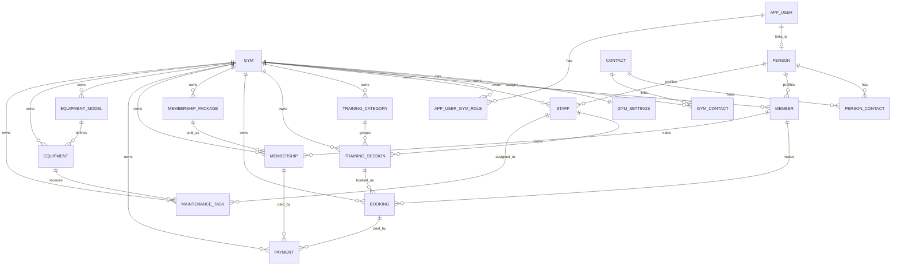

# Data Model

## Overview

The Final2 defense model is intentionally smaller than the earlier enterprise
SaaS model. The defended product is multi-gym operations plus memberships, not
platform support, billing, coaching, employment roster, or invoice/refund
ledger management.

Tenant-owned business rows use `GymId`.

## Mermaid ERD

## Defended Entities

Platform and tenant context:
- `Gym`
- `GymSettings`
- `AppUserGymRole`

Shared identity/person entities:
- `AppUser`
- `AppRole`
- `AppRefreshToken`
- `Person`
- `Contact`
- `PersonContact`
- `GymContact`

Tenant business entities:
- `Member`
- `Staff`
- `TrainingCategory`
- `TrainingSession`
- `Booking`
- `MembershipPackage`
- `Membership`
- `Payment`
- `EquipmentModel`
- `Equipment`
- `MaintenanceTask`

## Removed From Final2 Scope

The pruning migration `PruneFinal2Scope` removes these optional contexts:
- platform subscriptions, support tickets, audit log
- coaching plans and coaching plan items
- invoices, invoice lines, and invoice payments
- job roles, employment contracts, vacations, and work shifts
- opening hours and opening-hour exceptions
- maintenance assignment history

## Special Modeling Decisions

- `AppUser` stays separate from business profiles and links to `Person`.
- `AppUserGymRole` is the tenant membership table for gym and role switching.
- A training session has optional `TrainerStaffId`; the old contract/work-shift
  trainer assignment model was removed for Final2 scope control.
- `Payment` is the only finance transaction entity kept for the defense.
- Maintenance assignment notes are stored on `MaintenanceTask.Notes`; assignment
  history is no longer a separate entity.
- `LangStr` is used where DB-backed translation is required.
- tenant business entities inherit audit/soft-delete behavior through
  `TenantBaseEntity`.
