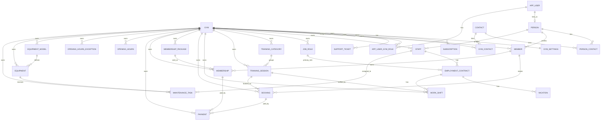

# Data Model

## Overview

The schema is split into:
- SaaS/platform entities
- shared person/contact entities
- gym tenant business entities

Key invariant:
- tenant-owned business rows use `GymId`

## Mermaid ERD

## Notes

Platform entities:
- `Gym`
- `GymSettings`
- `Subscription`
- `SupportTicket`
- `AuditLog`
- `AppUserGymRole`

Shared identity/person entities:
- `AppUser`
- `AppRole`
- `AppRefreshToken`
- `Person`
- `Contact`
- `PersonContact`
- `GymContact`

Tenant business entities:
- `Member`
- `Staff`
- `JobRole`
- `EmploymentContract`
- `Vacation`
- `TrainingCategory`
- `TrainingSession`
- `WorkShift`
- `Booking`
- `MembershipPackage`
- `Membership`
- `Payment`
- `OpeningHours`
- `OpeningHoursException`
- `EquipmentModel`
- `Equipment`
- `MaintenanceTask`

## Special Modeling Decisions

- `AppUser` stays separate from business profiles and links to `Person`
- `AppUserGymRole` is the tenant membership table for SaaS context switching
- `WorkShift` models both training delivery and assisting floor work
- multiple trainers per session are represented by multiple training shifts linked to the same session
- `LangStr` is used where DB-backed translation is required
- business entities inherit audit/soft-delete behavior through `TenantBaseEntity`
