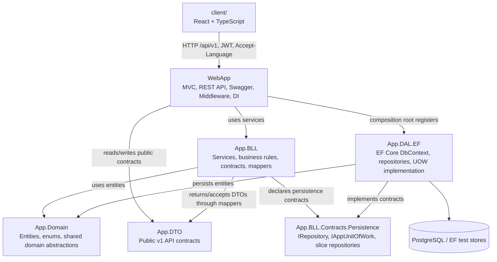
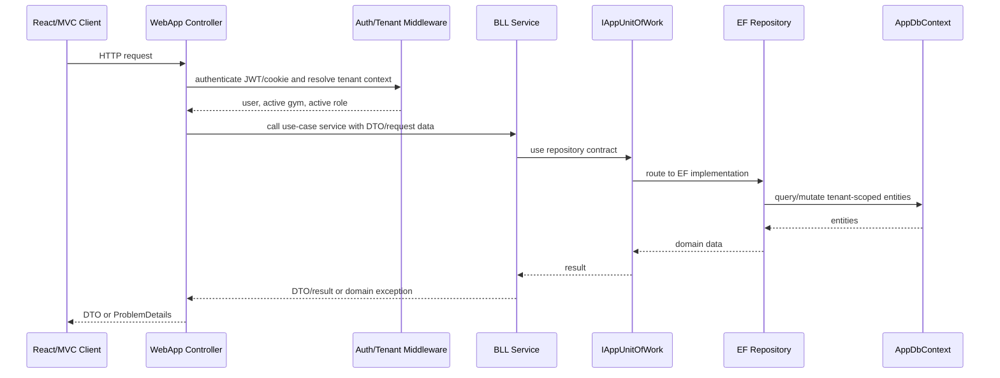
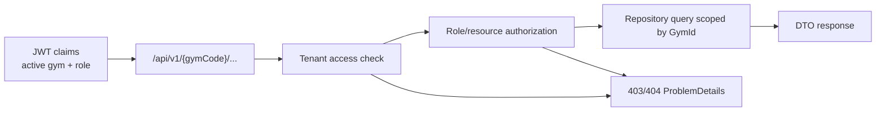

# Final1 Architecture Diagram

**Date:** 2026-04-30

## Clean/Onion Dependency Direction

Allowed direction:
- `WebApp -> App.BLL`
- `WebApp -> App.DTO`
- `App.BLL -> App.Domain`
- `App.BLL -> App.DTO`
- `App.DAL.EF -> App.BLL.Contracts`
- `App.DAL.EF -> App.Domain`
- `WebApp -> App.DAL.EF` only at the composition root and EF/Identity infrastructure setup

Forbidden direction:
- `App.Domain` must not reference `App.BLL`, `App.DAL.EF`, `App.DTO`, or `WebApp`.
- `App.DTO` must not reference `App.BLL`, `App.DAL.EF`, or `WebApp`.
- `App.BLL` must not reference `App.DAL.EF` or `WebApp`.
- `App.DAL.EF` must not reference `WebApp`.

These rules are enforced by `tests/WebApp.Tests/Architecture/ArchitectureTests.cs`.

## Final1 Request Flow

## Final1 Boundary Evidence

| Slice | Controller/service boundary | Persistence boundary | Mapper boundary |
|-------|-----------------------------|----------------------|-----------------|
| Auth sessions | `AccountController -> IAccountAuthService` | `IAppUnitOfWork.RefreshTokens -> IRefreshTokenRepository -> EfRefreshTokenRepository` | `IAuthResponseMapper -> AuthResponseMapper` |
| Members | `MembersController -> IMemberWorkflowService` | `IAppUnitOfWork.Members -> IMemberRepository -> EfMemberRepository` | `IMemberMapper -> MemberMapper` |
| Training/bookings | Training controllers -> `ITrainingWorkflowService` | training/category/session/booking/work-shift repositories | `ITrainingMapper -> TrainingMapper` |
| Membership/finance | package, membership, payment, finance services | package/membership/payment/finance repositories | `IMembershipFinanceMapper -> MembershipFinanceMapper` |
| Maintenance | maintenance/facility controllers -> `IMaintenanceWorkflowService` | `IAppUnitOfWork.Maintenance -> IMaintenanceRepository -> EfMaintenanceRepository` | `IMaintenanceMapper -> MaintenanceMapper` |

## Tenant Isolation Path

Defense statement:
- The route gym code is not trusted by itself.
- The active gym in the authenticated session must match the route gym code unless a system-admin flow explicitly switches context.
- Resource IDs are always looked up inside the active gym scope for Final1-critical slices.
