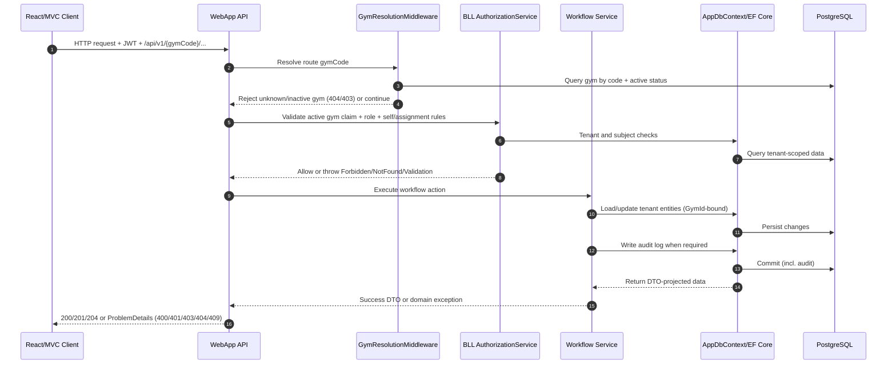

# Request Flow Diagram

## Notes
- Route middleware gives early tenant validation evidence.
- BLL authorization remains the final enforcement layer.
- EF soft-delete filters hide logically deleted tenant rows.
- Audit writes are persisted for security-sensitive actions.
