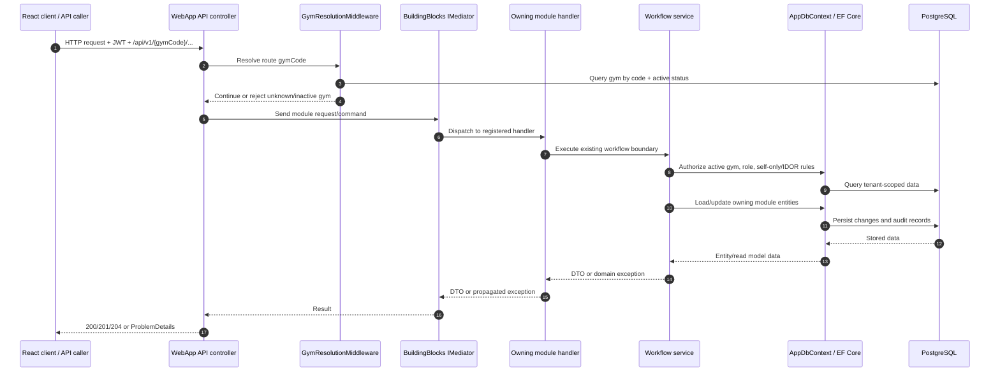
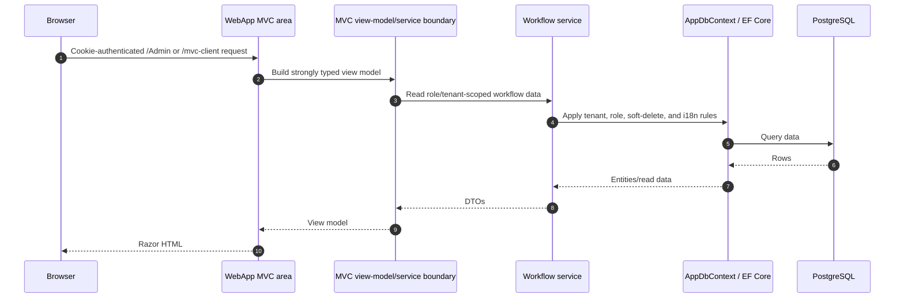

# Request Flow Diagram

## API / React Client Flow

## MVC Flow

## Boundary Notes

- `WebApp` is the only composition root and route owner.
- Migrated REST controllers use `IMediator`; modules do not reference each
  other directly.
- Auth, tenant, IDOR, soft-delete, and i18n rules remain enforced inside the
  workflow/data layers.
- Public API routes stay stable while controllers switch from direct service
  calls to mediator commands/queries.
- MVC Admin uses strongly typed view models and no `ViewBag`/`ViewData`.
