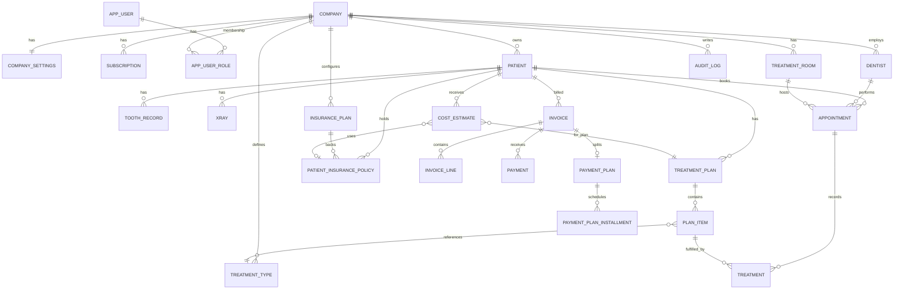

# Data Model

## Multi-tenant printsiip

Kõik tenant-spetsiifilised ärientiteedid sisaldavad `CompanyId` välja. `AppDbContext` rakendab globaalse tenant query filtri, mis piirab päringud jooksva requesti tenantiga.

## Põhientiteedid

### Platform / Identity

- `Company`
- `CompanySettings`
- `Subscription`
- `AppUser`
- `AppRole`
- `AppUserRole`
- `AuditLog`
- `AppRefreshToken`

### Clinical / tenant

- `Patient`
- `ToothRecord`
- `TreatmentType`
- `Treatment`
- `Appointment`
- `TreatmentPlan`
- `PlanItem`
- `Xray`
- `Dentist`
- `TreatmentRoom`

### Insurance / finance

- `InsurancePlan`
- `PatientInsurancePolicy`
- `CostEstimate`
- `Invoice`
- `InvoiceLine`
- `Payment`
- `PaymentPlan`
- `PaymentPlanInstallment`

## Olulisemad seosed

- `Company` 1:1 `CompanySettings`
- `Company` 1:n `Subscriptions`
- `AppUser` n:m `Company` läbi `AppUserRole`
- `Patient` 1:n `ToothRecord`, `Appointment`, `TreatmentPlan`, `Treatment`, `Xray`, `CostEstimate`, `Invoice`, `PatientInsurancePolicy`
- `TreatmentPlan` 1:n `PlanItem`
- `Appointment` 1:n `Treatment`
- `Treatment` võib viidata `PlanItem`-ile ja `Appointment`-ile
- `InsurancePlan` 1:n `PatientInsurancePolicy`
- `CostEstimate` võib viidata `TreatmentPlan`-ile ja `PatientInsurancePolicy`-le
- `Invoice` 1:n `InvoiceLine`
- `Invoice` 1:n `Payment`
- `Invoice` 1:1 `PaymentPlan`
- `PaymentPlan` 1:n `PaymentPlanInstallment`

## Indeksid

Olulisemad indeksid:

- `Company.Slug` unique
- `CompanySettings.CompanyId` unique
- `AppUserRole(AppUserId, CompanyId, RoleName)` unique
- `ToothRecord(CompanyId, PatientId, ToothNumber)` unique
- `PlanItem(CompanyId, TreatmentPlanId, Sequence)` unique
- `TreatmentRoom(CompanyId, Code)` unique
- `Invoice(CompanyId, InvoiceNumber)` unique
- `PatientInsurancePolicy(CompanyId, PatientId, PolicyNumber)` unique
- `InvoiceLine(CompanyId, InvoiceId)`
- `InvoiceLine(CompanyId, TreatmentId)`
- `InvoiceLine(CompanyId, PlanItemId)`
- `Payment(CompanyId, InvoiceId, PaidAtUtc)`
- `PaymentPlanInstallment(CompanyId, PaymentPlanId, DueDateUtc)`

## Soft delete

Soft delete on tenant-entiteetidel, mis pärivad `TenantBaseEntity`-st:

- `IsDeleted`
- `DeletedAtUtc`

Delete operatsioonid teisendatakse `SaveChangesAsync` sees soft delete'iks.

Märkus:

- `CompanySettings`, `Subscription` ja `AppUserRole` on tenant-andmed, kuid mitte soft-delete entiteedid

## Audit

`SaveChangesAsync` tekitab tenant-entiteetide muudatustest `AuditLog` read:

- `ActorUserId`
- `CompanyId`
- `EntityName`
- `EntityId`
- `Action`
- `ChangedAtUtc`
- `ChangesJson`

## Migratsioonistrateegia

- esmane migration: `InitialCreate`
- suuremad skeemimuudatused on eraldi migratsioonides
- käivitus:

```powershell
dotnet ef migrations add <Name> --project src/App.DAL.EF --startup-project src/WebApp
dotnet ef database update --project src/App.DAL.EF --startup-project src/WebApp
```

## ERD (mermaid)


